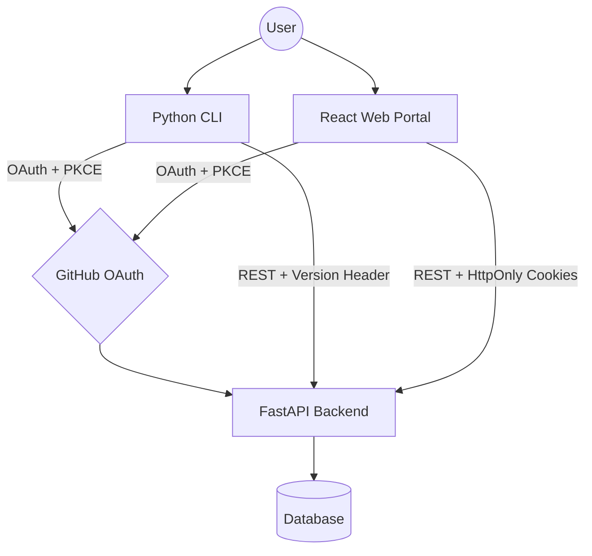

# Insighta Labs+ CLI

A command-line tool for interacting with the Insighta Profile Intelligence System. Supports GitHub OAuth login, profile management, search, and CSV export.


## System Architecture



Note:*This diagram represents the full Insighta ecosystem. This repository handles the Web portion of the architecture. I tried using <a href="https://mermaid.js.org" target="_blank" rel="noopener noreferrer">mermaid editor</a> to create this*


- Backend: FastAPI, deployed on Vercel — https://hng-stage-3-backend.vercel.app
- CLI: Python + Click, runs locally, installable via pip
- Web Portal: Frontend deployed on Vercel - https://insighta-frontend-nu.vercel.app
- Database: PostgreSQL (shared by CLI and Web )


## Authentication Flow
### CLI Flow (OAuth + PKCE)

1. User runs: insighta login

2. CLI generates:
   - state → CSRF protection token
   - code_verifier → random secret (stored locally)
   - code_challenge → SHA256(code_verifier), base64url-encoded

3. CLI starts a local HTTP server on localhost:8484

4. CLI opens browser to:
   GET /auth/github?source=cli&state=...&code_challenge=...&code_challenge_method=S256

5. Backend stores {state, source="cli"} in PendingState table
   (code_challenge is stored for reference but NOT forwarded to GitHub)

6. Backend redirects browser to GitHub OAuth

7. User authorizes on GitHub

8. GitHub redirects to:
   GET /auth/github/callback?code=...&state=...

9. Backend:
   - Validates state against PendingState
   - Exchanges code with GitHub (no code_verifier — GitHub didn't receive a challenge)
   - Creates or updates user record
   - Issues access token (3 min) + refresh token (5 min)
   - Redirects to: http://localhost:8484/callback?access_token=...&refresh_token=...&state=...

10. CLI callback server:
    - Captures tokens from redirect URL
    - Validates state matches original (CSRF check)
    - Saves credentials to ~/.insighta/credentials.json

11. CLI prints: ✓ Logged in as @username


###  Web Flow (OAuth + HTTP-only Cookies)

1. User clicks "Continue with GitHub"
2. Browser → GET /auth/github?source=web
3. Backend generates PKCE pair, stores state + code_verifier
4. Backend redirects to GitHub
5. GitHub redirects to /auth/github/callback
6. Backend exchanges code + code_verifier with GitHub
7. Tokens set as HTTP-only cookies (which is not accessible via JS)
8. Browser redirected to /dashboard


## Installation

### Requirements

- Python 3.10+
- pip

# Clone the CLI repository
```
git clone https://github.com/Chimereya/hng-stage-3-cli
cd hng-stage-3-cli
```

# Install globally
```
pip install -e .
```

*After installation, insighta is available from any directory.*

## CLI Usage
### Auth Commands
```
# Login via GitHub OAuth
insighta login

# Show current logged-in user
insighta whoami

# Logout and clear stored credentials
insighta logout
```

## Profile Commands

```
# List all profiles (paginated)
insighta profiles list

# Filter by gender
insighta profiles list --gender male

# Filter by country and age group
insighta profiles list --country NG --age-group adult

# Filter by age range
insighta profiles list --min-age 25 --max-age 40

# Sort results
insighta profiles list --sort-by age --order desc

# Paginate
insighta profiles list --page 2 --limit 20

# Get a single profile by ID
insighta profiles get <profile_id>

# Natural language search
insighta profiles search "young males from nigeria"

# Create a new profile (admin only)
insighta profiles create --name "Harriet Tubman"

# Export profiles to CSV (saved to current directory)
insighta profiles export --format csv

# Export with filters
insighta profiles export --format csv --gender male --country NG
```

## Token Handling
Here’s a README-style table based on what you provided:

| Token | Expiry | File Path |
|---|---:|---|
| Access token | 3 min | `~/.insighta/credentials.json` |
| Refresh token | 5 min | `~/.insighta/credentials.json` |

Every API request uses the stored access token via Authorization: Bearer <token>
On a 401 response, the CLI automatically attempts a token refresh via POST /auth/refresh
If refresh succeeds, the original request is retried with the new token
If refresh fails, the user is prompted to run insighta login again
Token rotation: each refresh invalidates the old refresh token and issues a new pair
Credentials are cleared on insighta logout


## Role Enforcement

| Role | Permissions |
|---|---|
| `admin` | Full access: list, get, search, create, export |
| `analyst` | Read-only: list, get, search, export |


- Default role on first login: analyst
- Role is encoded in the JWT payload and verified on every request
- POST /api/profiles (create) returns 403 for non-admin users
- All /api/* endpoints require a valid access token + X-API-Version: 1 header


## Natural Language Search

The search command (insighta profiles search) sends a free-text query to GET /api/profiles/search?q=... which uses natural language parsing on the backend to extract filters such as gender, country, and age group from the query string before querying the database.

#### Examples
```
insighta profiles search "young males from nigeria"
insighta profiles search "senior women in the US"
insighta profiles search "adults between 30 and 40"
```


## Environment Variables
The CLI reads INSIGHTA_API_URL if set, otherwise defaults to the production backend:

```
export INSIGHTA_API_URL="https://hng-stage-3-backend.vercel.app"
```


## Credentials File
Stored at ~/.insighta/credentials.json:
```
{
  "access_token": "...",
  "refresh_token": "...",
  "user": {
    "username": "mrman",
    "email": "mrman@example.com",
    "role": "analyst",
    "avatar_url": "https://avatars.githubusercontent.com/..."
  }
}
```


## CI/CD
GitHub Actions runs on every PR to main:

- Linting (flake8)
- Tests (pytest)
- Build check (pip install -e .)
